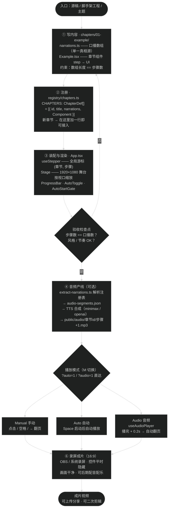

# 从一篇文章到一部「电影感」演示视频：拆解 web-video-presentation 这个 Agent 技能

> 适合读者：有少量前端/AI 基础、但还没写过完整项目、对「AI 辅助创作」感兴趣的同学。
> 本文不假设你会 React 或 TypeScript——每个名词都会用大白话先解释一遍。

---

## 开场：一个几乎人人都遇到过的场景

你有没有过这种经历：演讲稿写好了，分享提纲也列好了，但要把它们变成一套"好看、能讲、还能直接录成视频"的演示稿，就得在 PPT 里对着模板拖半天？

这个项目换了个完全不同的思路：**不用 PPT，用网页来做演示。**

`web-video-presentation` 是开源仓库 [ConardLi/garden-skills](https://github.com/ConardLi/garden-skills) 里的一个 **Agent 技能包（v 1.2.2）**。它能把一篇稿子（脚本、大纲、博客）自动加工成一个 16:9 的网页演示，你只需要**点鼠标翻页**，就能把这个网页**录屏成一部有电影质感的短片**。

我最近真的把它跑起来了，用它的脚手架在本地生成了一套演示项目并逐屏验证过。这篇文章就沿着它的**运行流程**和**核心思路**，一层层拆给你看。

---

## 一、先搞清楚：这不是"软件"，而是"给 AI 的岗位说明书 + 工具箱"

很多同学第一次听到 "Agent Skill" 会以为是个 App。其实不是。

你可以把它理解成一套**「喂给 AI 助手的工作包」**，里面装着四样东西：

| 组成 | 作用 | 大白话 |
|---|---|---|
| `SKILL.md` | 主手册 | 告诉 AI「按什么流程干活、先做什么后做什么、验收标准是什么」 |
| `references/` | 方法论文档 | 章法怎么写、大纲怎么列、怎么避免 AI 味、怎么录屏 |
| `templates/` | 代码骨架 | 直接能跑的 React + TypeScript 工程模板 |
| `themes/` | 主题库 | 23 套现成主题，比如暗色印刷、亮色杂志、终端绿 |

所以这个项目的"产品"其实有两层：**一层是给 AI 的规则，一层是给人类的成品网页。** 这正是它和普通脚手架最大的区别——它关注的不是"你手动做演示"，而是"AI 怎么稳定地帮你做出演示"。

---

## 二、最核心的设计：单一真相源（single source of truth）

项目里有一份文件叫 `narrations.ts`，它是我认为**整个项目最聪明的一个设计**：

```ts
export const narrations: Narration[] = [
  "这是示例章节的第一步。把这一行换成你这一步的口播文案。",  // step 0
  "第二步。每个数组元素对应章节里 step === N 的那一屏。",     // step 1
  "第三步。这个数组就是音频合成 + 自动播放的唯一真相源。",    // step 2
];
```

规则只有一条：**这个数组的长度必须严格等于章节里渲染的屏数。**

这句话的威力在哪儿？想想传统做法：PPT 的"几页"、讲稿的"几段"、配音的"几条音频"是**三份独立的东西**，改一页大纲忘了改配音脚本——翻车了。

而在本项目里，这三件事**共用一份数据**：

- 页面有几屏 → 看数组长度
- 每屏讲什么 → 看数组内容
- 每屏的配音 → 由 extract-narrations 脚本从这份数组生成

> 类比：剧本和分镜表是同一张纸。剧情改了，分镜跟着改，永远对不上不了。

这就是计算机里常说的 **single source of truth（单一真相源）**。对你的启发是：**只要两份信息描述的是同一件事，就应该由一份数据推导出另一份，而不是人肉同步。** 这个思想以后写任何项目都用得上。

---

## 三、主题与内容「解耦」：换皮不换骨

另一个核心设计是**主题系统**。看一下示例章节（`Example.css`）是怎么写样式的：

```css
.ex-cover-h {
  font-size: var(--t-display-2);   /* 只用语义 token，不写死字号 */
}
```

章节代码里**永远不出现具体的颜色和字体**，只引用一种叫 **CSS 变量（语义 token）** 的东西，比如 `--shell`（背景）、`--text`（文字）、`--accent`（强调色）、`--t-display-2`（标题字号）。

真正的颜色和字体，集中定义在一个文件里：`src/styles/tokens.css`。

```css
:root {
  --shell: #0d0b09;      /* 近黑的画布 */
  --text: #f5f0e5;       /* 米白的正文 */
  --accent: #ff4a2b;     /* 红橙强调色 */
}
```

后果非常爽：**想换一套视觉风格？把 tokens.css 换掉，全部章节瞬间变装。** 技能包自带了 23 套主题，比如暗色印刷（我演示用的）、亮色杂志风、瑞士极简、终端绿……

> 类比：你的内容是一套家具，主题是墙纸。家具不变，换个墙纸就是另一种气质。

这背后是**「内容与表现分离」**的设计哲学，也是前端里「设计系统（design system）」的入门形态。就算你以后不搞前端，这个"用一套统一的口径管理所有视觉细节"的思路在写代码、做表格、做设计时都极其有用。

---

## 四、工作流：两个「检查点」把 AI 的活规范化

技能包给 AI 规定的工作流，我认为是它最值得学的地方——因为它把"让 AI 干活"从**撞大运**变成了**可控流程**：

```
Phase 1  写稿（脚本 / 大纲）
   ↓
🟢 Checkpoint Plan —— 必须和用户对齐 5 件事：
   脚本 / 大纲 / 主题 / 素材 / 开发模式
   ↓
Phase 2  开发章节
   （第一章先做出来当「锚点」，用户验收满意后，再批量推进）
   ↓
🟢 Checkpoint Audio —— 逐章自检：步骤数 == 口播数？
   ↓
Phase 3 （可选）音频合成
Phase 4  录屏成片
```

两个细节特别聪明：

1. **第一章 = 锚点**。AI 先只做第一章给你看，你确认风格、节奏、交互没跑偏，它才继续做剩下的。这避免了"全做完才发现方向错了"的大返工。
2. **硬性自检协议**。进入检查点前，AI 必须让一个独立"审查者"角色检查自己的产物，不合格不许继续。**让 AI 检查 AI**——用双保险对抗大模型的"自我感觉良好"。

> 把任务拆成带验收点的流水线

---

## 五、把它跑起来：五分钟上手实录

理论讲完，来看真实过程。我这次的实际操作（技术细节你可以跳过，不影响理解整体）：

1. 用 Vite 脚手架创建了 React + TypeScript 工程（`npm create vite`）
2. 装上技能提供的模板文件：组件、钩子、示例章节、主题 tokens
3. 接好 npm 脚本：`typecheck`（类型检查）、`extract-narrations`（提取口播）
4. `npm run dev` 启动本地开发服务器 → **http://localhost:5174**

这里有个小知识：演示舞台是**固定 1920×1080 的逻辑分辨率**，然后按浏览器窗口等比缩放（最小缩到 320×180）。也就是说，**你写内容时永远按 16:9 的"电影画幅"排版，不管在什么屏幕上看都不会变形**——这也是为什么它能放心录屏。

跑起来之后的操作极简：

| 按键 | 效果 |
|---|---|
| 点击 / 空格 / → | 下一页 |
| ← / Backspace | 上一页 |
| `M` | 切换播放模式：手动 → 音频 → 自动 |
| `?auto=1` / `?audio=1` | 打开链接直接进入自动 / 音频模式 |
| Space（自动模式下） | 开始自动播放 |

还有一个细节：你的观看进度会存在浏览器的 `localStorage` 里（键名 `presentation-cursor-v4`），刷新页面不会丢进度——这种"无后端也能记住状态"的小技巧，也是前端很有意思的点。

我实测的验证结果：

| 检查项 | 结果 |
|---|---|
| TypeScript 类型检查 | ✅ 通过 |
| 开发服务器 | ✅ 运行在 5174 端口 |
| 无头浏览器渲染 3 个步骤 | ✅ 全部正常，点击推进 OK |
| 口播提取脚本 | ✅ 3 段口播 → `audio-segments.json` |

第一屏的实际样子：近黑色画布上，衬线体大标题（中文白体 + 英文红橙斜体）居中偏左，左上角眉标 `CHAPTER 01 — EXAMPLE`，底部一行"点击任意处继续"的小字——非常典型的杂志式编辑排版，完全不是"模板味"。

---

## 六、配音哪来的？一条可选的「自动化配音流水线」

如果你想做成真正的视频而不是网页，光有画面不够，还得有声音。技能包为此搭了一条**可选**的流水线：

```
src/registry/chapters.ts ──解析──▶ extract-narrations.ts
      │                              │
      │ 章节顺序 + 每步口播            ▼
      │                       audio-segments.json
      │                              │
      └──────────▶ TTS 提供者（minimax / openai）─▶ public/audio/xxx.mp3
                                                        │
                         自动播放模式：音频播完 + 0.2s 缓冲 ──▶ 自动翻页
```

关键点有两个：

1. **口播文本 = narrations 数组**，就是第二节说的"单一真相源"。不需要单独维护一份配音稿。
2. **TTS（文字转语音）**：技能提供了两套内置配音驱动——Minimax（默认）和 OpenAI，你也完全可以把 mp 3 手动放进 `public/audio/章节id/步骤.mp3`。

顺便一提，数组里某一步写 **空字符串** 就表示"这一步是静音过渡"，自动播放会按估算时长停留后继续——这个设计说明作者真的考虑过"哪一步需要讲、哪一步只需要停顿"的节奏问题。

如果哪一步的口播比动画短，画面会显得仓促——所以 SKILL.md 里定了一条铁律：**动画时长必须 ≤ 口播时长**，宁可把口播写长一点，也不要让观众等干屏。这种"用规则约束节奏"的思路，正是成品有没有"电影感"的分水岭。

---

## 七、最后一步：录屏成片

网页做好、音轨就位之后，"出片"就只是录屏的事了：

- 手动模式 + 后期配音：录屏时一边点一边讲，配乐在剪辑软件里加（最灵活）
- 音频模式：浏览器里直接播放合成好的口播，录屏即是成品（最省事）
- 自动模式：全自动翻页，适合纯演示场合

因为舞台固定 16:9、界面里没有杂乱的开发工具痕迹（进度条和模式开关都是"悬停才浮现"的，平时完全透明），录出来的画面干净得像专门做的一样。

---

## 八、对学生的价值：这个项目能教会你什么

如果你正处于"会一点 HTML/CSS/JS，但没写过完整项目"的阶段，这个技能包是个绝佳的解剖样本：

1. **一个最小而完整的前端工程长什么样**：Vite（开发服务器 + 打包）、React（组件化 UI）、TypeScript（带类型检查的 JavaScript）三者的分工，一台 `npm run dev` 就能看见全貌。
2. **CSS 变量做主题系统**：`tokens.css` + 语义 token，几十行代码就讲清了"设计系统"的入门思想。
3. **数据驱动 UI**：一个数组同时决定"有几屏、每屏讲什么、每屏配什么音"——这是所有现代前端框架的核心思想：**界面是数据的投影**。
4. **给 AI 立规矩**：`SKILL.md` + 双检查点工作流，就是眼下最热门的 "prompt 工程 / agent 工程" 的实体教案。与其背一堆提示词技巧，不如看看别人是怎么把一套流程写成说明书的。
5. **动手实验清单**（按难度递增）：
   - 打开 http://localhost:5174，按 `M` 切模式体验三种播放
   - 换主题：把 `themes/` 里任意一个 `tokens.css` 覆盖到 `src/styles/tokens.css`，刷新看"换皮"
   - 改口播：编辑 `narrations.ts` 的文案，刷新即生效（记得保持数组长度不变）
   - 加自己的章节：照着 `01-example` 抄一个 `02-xxx`，在 `registry/chapters.ts` 里注册
   - 跑整条音频管线：配置好 TTS key，`npm run extract-narrations` → `npm run synthesize-audio`

## 结尾

回头看，这个项目最打动我的不是"网页演示"这个形态本身，而是它体现的三种工程智慧：

- **单一真相源**——让多份信息永远不自相矛盾；
- **内容与表现分离**——让换皮变成一次复制粘贴；
- **流程 + 检查点**——让 AI 的产出从"看运气"变成"可验收"。

这三条，恰好也是**软件工程里最高频复用、最值得早期习得**的原则。把它当教程拆一遍，你收获的不只是一个演示，而是一整套"结构化思考"的模板——比我当年对着教程抄一百遍 `console.log` 有用多了。

如果你想动手，仓库在 [ConardLi/garden-skills](https://github.com/ConardLi/garden-skills)（`skills/web-video-presentation` 目录），方法论文档 `SKILL.md`、`CHAPTER-CRAFT.md`、`THEMES.md` 都写得非常细，照着走一遍，你就是下一个能把稿子变成片子的人。

---

*本文基于 web-video-presentation v 1.2.2 实测（本地生成的演示工程 + 浏览器渲染 + 音频管线验证）。*

